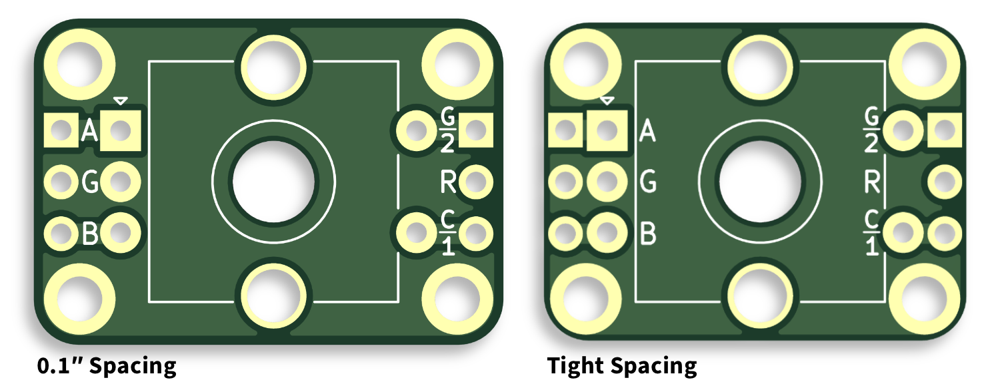
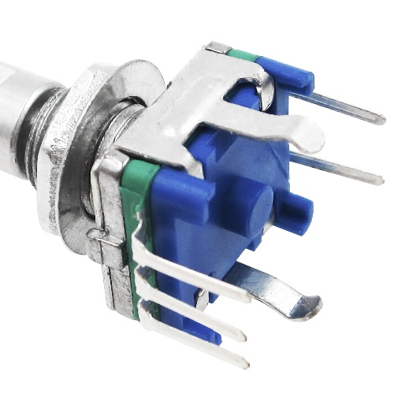
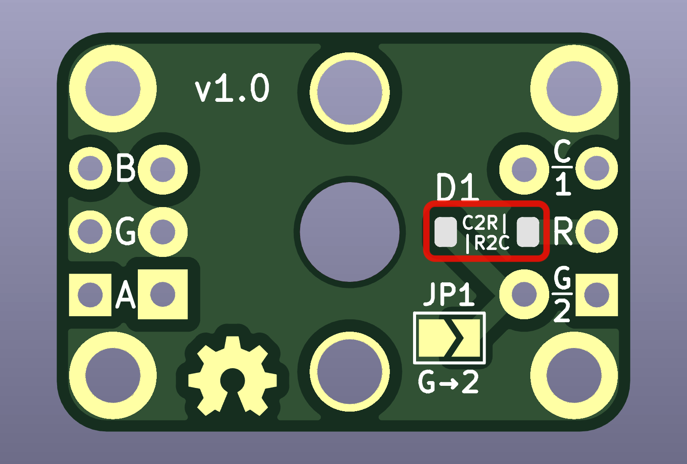

# Encoder Mount PCB

This is a simple PCB for mounting [EC11]-type rotary encoders. It is intended for use in keyboard
projects and provides an alternative mounting option for securing an encoder as well as easier
wiring into a keyboard matrix. Included are the [KiCad] PCB design files and, soon (!!) [Gerber
format] files for PCB production.

## Sizes

The PCB comes in two sizes:

 * **0.1″ spacing** – 23×16mm — the break-out pins are 8×0.1″ (20.32mm) apart and should therefore
   be compatible with standard breadboards and prototype PCBs.
 * **tight** — 20.7×15.6mm — this is a smaller board for fitting into tighter spaces.

Both sizes have the same functionality.

## Mounting

The PCB provides four M2 mounting holes to provide a sturdy base for the encoder when it is bolted
to the keyboard’s plate or base. The PCB can also be used with Kevin Eckert’s [EC11 to MX
Switchplate Adapter][ec112mx].

When using an encoder that has a base with a central pillar and four legs on the corners (as shown
below), the outer legs can be clipped and/or sanded. Both boards provide space for the pillar, which
allows for a more compact installation.

Genuine ALPS EC11 encoders have even squatter bases, but, in addition to typically being more
expensive, do not appear to be available with threaded collars. This may mean they are impractical
in some situations, although the M2 mounting holes on these PCBs may reopen some possibilities.

## Wiring

### Encoder

The PCB breaks out the following pins as labelled on the PCB:

 * `A` — encoder A pin
 * `G` — the common or ground pin
 * `B` — encoder B pin

### Switch

To access the push switch pins the following are used:

 * `C/1`
 * `G/2`

However there are a couple of extra features to improve handling of the switch when used in a
keyboard.

#### Standard Keyboard Matrix

If used in a standard [keyboard matrix], a 1N4841 [SOD-123] SMD diode can be soldered in position
`D1`, with the direction depending on whether the matrix is Column-to-Row or Row-to-Column. The
labels `C2R|` and `|R2C` indicate the correct orientation for each of these matrix directions.

If D1 is populated, then the switch is connected as follows:

 * `R` — the switch’s row
 * `C/1` — the switch’s column

#### Direct Pin Matrix

If a [direct pin matrix] is used, where each switches is wired between ground and a separate I/O
pin, then the connection to ground can optionally be made by soldering across jumper `JP1`.

In this case, the switch is wired as follows:

 * `C/1` — to the switch’s I/O pin
 * `G/2` — can be left unconnected, wired to another switch, or can be connected to ground *instead
   of* `G`

[EC11]: https://tech.alpsalpine.com/e/products/detail/EC11E15204A3/
[KiCad]: https://www.kicad.org
[Gerber format]: https://en.wikipedia.org/wiki/Gerber_format
[ec112mx]: https://www.thingiverse.com/thing:3770166
[keyboard matrix]: https://www.pcbheaven.com/wikipages/How_Key_Matrices_Works/
[SOD-123]: https://en.wikipedia.org/wiki/Small_Outline_Diode
[direct pin matrix]: https://docs.qmk.fm/#/porting_your_keyboard_to_qmk?id=direct-pin-matrix
