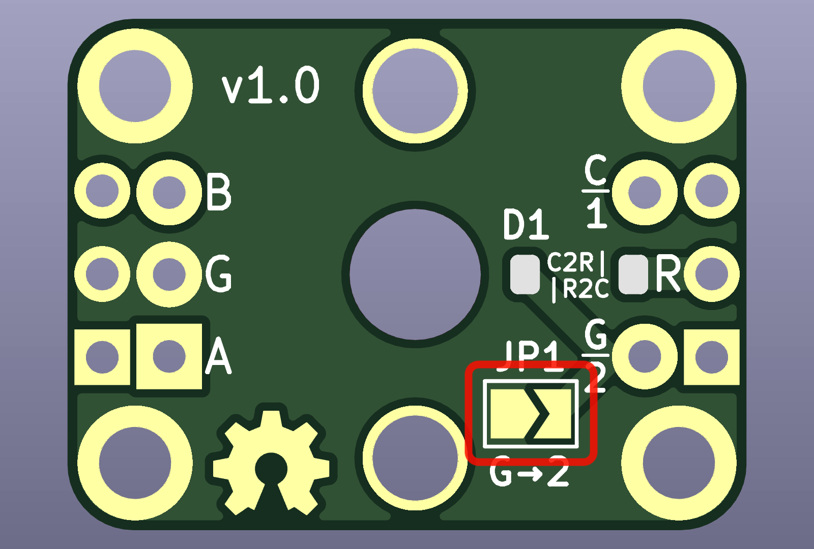

# Encoder Mount PCB

This is a simple PCB for mounting [EC11]-type rotary encoders. It is intended for use in keyboard
projects. Included are the [KiCad] PCB design files and, soon (!!) [Gerber format] files for PCB
production.

## Sizes

The PCB comes in two sizes:

 * **0.1″ spacing** – 23×16mm — the break-out pins are 8×0.1″ (20.32mm) apart and should therefore
   be compatible with standard breadboards and prototype PCBs.
 * **tight** — 20.7×15.6mm — this is a smaller board for fitting into tighter spaces.

Both sizes have the same functionality.

&nbsp;

## Wiring

### Encoder

The PCB breaks out the following pins as labelled on the PCB:

 * `A` — encoder A pin
 * `G` — the common or ground pin
 * `B` — encoder B pin

### Switch

To access the push switch pins the following are used:

 * `C/1`
 * `G/2`

However there are a couple of extra features to improve handling of the switch when used in a
keyboard.

#### Standard Keyboard Matrix

If used in a standard [keyboard matrix], a 1N4841 [SOD-123] SMD diode can be soldered in position
`D1`, with the direction depending on whether the matrix is Column-to-Row or Row-to-Column. The
labels `C2R|` and `|R2C` indicate the correct orientation for each of these matrix directions.

If D1 is populated, then the switch is connected as follows:

 * `R` — the switch’s row
 * `C/1` — the switch’s column

#### Direct Pin Matrix

If a [direct pin matrix] is used, where each switches is wired between ground and a separate I/O
pin, then the connection to ground can optionally be made by soldering across jumper `JP1`.

In this case, the switch is wired as follows:

 * `C/1` — to the switch’s I/O pin
 * `G/2` — can be left unconnected, wired to another switch, or can be connected to ground *instead
   of* `G`

[EC11]: https://tech.alpsalpine.com/e/products/detail/EC11E15204A3/
[KiCad]: https://www.kicad.org
[Gerber format]: https://en.wikipedia.org/wiki/Gerber_format
[keyboard matrix]: https://www.pcbheaven.com/wikipages/How_Key_Matrices_Works/
[SOD-123]: https://en.wikipedia.org/wiki/Small_Outline_Diode
[direct pin matrix]: https://docs.qmk.fm/#/porting_your_keyboard_to_qmk?id=direct-pin-matrix
